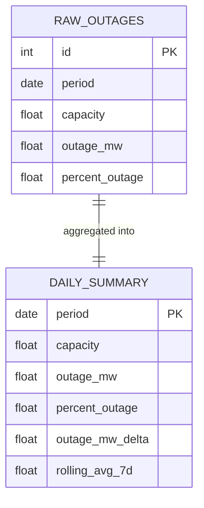

# ☢ Nuclear Outages Pipeline

End-to-end data pipeline that extracts U.S. nuclear outage data from the **EIA Open Data API**, stores it in Parquet files, exposes it via a REST API, and provides a web dashboard.

---

## ER Diagram



### Table descriptions

**`raw_outages`** — daily U.S. nuclear outage facts (one row per day)

| Column | Type | Description |
|--------|------|-------------|
| `id` | int | Surrogate primary key |
| `period` | date | Reporting date |
| `capacity` | float | Total nameplate capacity (MW) |
| `outage_mw` | float | Total MW offline |
| `percent_outage` | float | % of capacity offline |

**`daily_summary`** — same data enriched with analytics

| Column | Type | Description |
|--------|------|-------------|
| `period` | date | Primary key |
| `capacity` | float | Total nameplate capacity (MW) |
| `outage_mw` | float | Total MW offline |
| `percent_outage` | float | % of capacity offline |
| `outage_mw_delta` | float | Day-over-day change in MW offline |
| `rolling_avg_7d` | float | 7-day rolling average of outage_mw |

---

## Architecture

```
EIA API → connector.py → Parquet (raw)
                       → data_model.py → Parquet (model: raw_outages / daily_summary)
                                       → api.py (FastAPI) → frontend/index.html
```

---

## Quick Start

### 1. Clone & install dependencies

```bash
git clone <your-repo-url>
cd nuclear-outages-pipeline

python -m venv venv
# Mac/Linux:
source venv/bin/activate
# Windows:
venv\Scripts\activate

pip install -r requirements.txt
```

### 2. Set your EIA API Key

Register for a free key at https://www.eia.gov/opendata/

```bash
# Mac/Linux:
export EIA_API_KEY="your_key_here"

# Windows CMD:
set EIA_API_KEY=your_key_here
```

### 3. Run the full pipeline

```bash
# Extract data from EIA API (incremental by default)
python connector.py

# Build normalized data model
python data_model.py

# Start the REST API
uvicorn api:app --host 127.0.0.1 --port 8000 --reload

# Open the dashboard
# Mac:   open frontend/index.html
# Windows: start frontend\index.html
```

---

## API Endpoints

| Method | Path | Description |
|--------|------|-------------|
| GET | `/` | Health check |
| GET | `/data` | Query outage records (paginated + filtered) |
| POST | `/refresh` | Trigger EIA extraction + model rebuild |
| GET | `/summary` | Daily U.S. aggregate totals with rolling avg |

### `/data` Query Parameters

| Parameter | Type | Description |
|-----------|------|-------------|
| `start_date` | date | Filter from date (YYYY-MM-DD) |
| `end_date` | date | Filter to date (YYYY-MM-DD) |
| `page` | int | Page number (default: 1) |
| `limit` | int | Records per page (default: 100, max: 5000) |

### Example requests

```bash
# Latest 5 records
curl "http://localhost:8000/data?limit=5"

# Filter by date range
curl "http://localhost:8000/data?start_date=2024-01-01&end_date=2024-12-31"

# Trigger incremental refresh
curl -X POST "http://localhost:8000/refresh"

# Force full re-extraction
curl -X POST "http://localhost:8000/refresh?full=true"
```

### Example response (`/data`)

```json
{
  "total": 7019,
  "page": 1,
  "limit": 5,
  "data": [
    {
      "id": 7019,
      "period": "2026-03-20",
      "capacity": 100013.0,
      "outage_mw": 15917.108,
      "percent_outage": 15.92
    }
  ]
}
```

---

## Environment Variables

| Variable | Required | Description |
|----------|----------|-------------|
| `EIA_API_KEY` | ✅ Yes | EIA API key for data extraction |
| `APP_API_KEY` | No | If set, all API endpoints require `X-API-Key: <value>` header |
| `API_HOST` | No | API bind address (default: `127.0.0.1`) |

---

## Running Tests

```bash
pytest tests/ -v
```

Expected output: **14 passed**

---

## Project Structure

```
nuclear-outages-pipeline/
├── connector.py          # Part 1 – EIA data extraction
├── data_model.py         # Part 2 – schema normalization
├── api.py                # Part 3 – FastAPI REST API
├── frontend/
│   └── index.html        # Part 4 – web dashboard
├── tests/
│   └── test_pipeline.py  # unit + integration tests
├── er_diagram.md         # ER diagram
├── requirements.txt      # Python dependencies
└── README.md
```

---

## Assumptions Made

1. The `us-nuclear-outages` endpoint returns **national daily aggregates** (one row per day), not per-plant data. Per-plant data is available via `facility-nuclear-outages` and `generator-nuclear-outages`.
2. `period` is the natural unique key — deduplicated on merge so re-runs are idempotent.
3. The frontend connects to `http://localhost:8000` by default — change `API_BASE` in `index.html` for remote deployments.
4. Authentication is optional: the API works without `APP_API_KEY` set.

---

## Bonus Features

- ✅ **Incremental extraction** — checkpoint file tracks last run date; only fetches new records on subsequent runs
- ✅ **Auth/authorization** — optional `X-API-Key` header validation via `APP_API_KEY` env var
- ✅ **14 unit + integration tests** — covers connector, data model, and API endpoints
