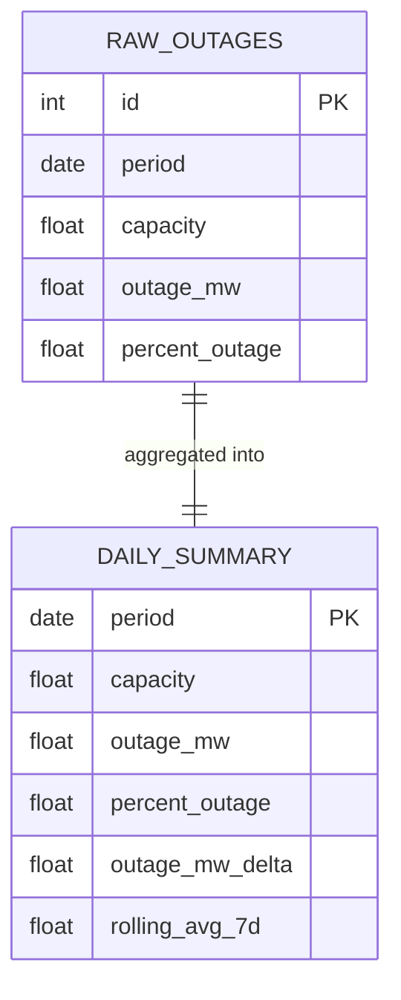

# Nuclear Outages Pipeline

End-to-end data pipeline that extracts U.S. nuclear outage data from the **EIA Open Data API**, stores it in Parquet files, exposes it via a REST API, and presents it through a web dashboard.

**Live demo:**
- API: https://nuclear-outages-pipeline-production.up.railway.app/docs
- Dashboard: https://aquamarine-tartufo-b0b464.netlify.app

---

## Overview

This project was built as a technical challenge and covers the full data pipeline lifecycle:

1. **Data extraction** — a connector script fetches nuclear outage data from the EIA Open Data API with pagination, error handling, retries, and incremental extraction
2. **Data modeling** — raw data is normalized into two analytical tables stored as Parquet files
3. **REST API** — a FastAPI service exposes the data with filtering, pagination, and a refresh endpoint
4. **Web dashboard** — a frontend interface displays the data with sorting, filtering, and real-time refresh

---

## Architecture

```
EIA API
   │
   ▼
connector.py  ──────────────────────────► nuclear_outages.parquet (raw)
                                                    │
                                                    ▼
                                          data_model.py
                                                    │
                                    ┌───────────────┴───────────────┐
                                    ▼                               ▼
                           raw_outages.parquet          daily_summary.parquet
                                    │
                                    ▼
                               api.py (FastAPI)
                            ┌───────┴────────┐
                            ▼                ▼
                        Railway           Netlify
                       (API host)     (dashboard host)
```

---

## Quick Start

### 1. Clone & install dependencies

```bash
git clone https://github.com/TU_USUARIO/nuclear-outages-pipeline.git
cd nuclear-outages-pipeline

python -m venv venv

# Mac/Linux:
source venv/bin/activate
# Windows:
venv\Scripts\activate

pip install -r requirements.txt
```

### 2. API Key Setup

Register for a free key at https://www.eia.gov/opendata/

```bash
# Mac/Linux:
export EIA_API_KEY="your_key_here"

# Windows CMD:
set EIA_API_KEY=your_key_here
```

### 3. Run the full pipeline

```bash
# Step 1 — Extract data from EIA API (~7,000 records)
python connector.py

# Step 2 — Build normalized data model
python data_model.py

# Step 3 — Start the REST API
uvicorn api:app --host 127.0.0.1 --port 8000 --reload

# Step 4 — Open the dashboard
# Mac:    open frontend/index.html
# Windows: start frontend\index.html
```

> For local development, make sure `frontend/index.html` has `const API = "http://localhost:8000"`.

---

## API Endpoints

| Method | Path | Description |
|--------|------|-------------|
| GET | `/` | Health check |
| GET | `/data` | Query outage records (paginated + filtered) |
| POST | `/refresh` | Trigger EIA extraction in background |
| GET | `/refresh/status` | Check status of ongoing refresh |
| GET | `/summary` | Daily U.S. aggregate totals with rolling avg |

### `/data` Query Parameters

| Parameter | Type | Default | Description |
|-----------|------|---------|-------------|
| `start_date` | date | — | Filter from date (YYYY-MM-DD) |
| `end_date` | date | — | Filter to date (YYYY-MM-DD) |
| `page` | int | 1 | Page number |
| `limit` | int | 100 | Records per page (max: 5000) |

---

## Result Examples

### `GET /`
```json
{
  "status": "ok",
  "message": "Nuclear Outages API is running."
}
```

### `GET /data?limit=3`
```json
{
  "total": 7022,
  "page": 1,
  "limit": 3,
  "data": [
    {
      "id": 7022,
      "period": "2026-03-23",
      "capacity": 100013.0,
      "outage_mw": 20501.0,
      "percent_outage": 20.5
    },
    {
      "id": 7021,
      "period": "2026-03-22",
      "capacity": 100013.0,
      "outage_mw": 18436.0,
      "percent_outage": 18.4
    },
    {
      "id": 7020,
      "period": "2026-03-21",
      "capacity": 100013.0,
      "outage_mw": 16842.0,
      "percent_outage": 16.8
    }
  ]
}
```

### `GET /data?start_date=2024-01-01&end_date=2024-01-03`
```json
{
  "total": 3,
  "page": 1,
  "limit": 100,
  "data": [
    {
      "id": 3422,
      "period": "2024-01-03",
      "capacity": 100013.0,
      "outage_mw": 12500.0,
      "percent_outage": 12.5
    }
  ]
}
```

### `POST /refresh`
```json
{
  "status": "accepted",
  "message": "Refresh started in background. Call /refresh/status to check progress."
}
```

### `GET /refresh/status`
```json
{
  "running": false,
  "last_result": "OK — 1 rows extracted",
  "error": null
}
```

### `GET /summary?limit=2`
```json
{
  "total": 7022,
  "page": 1,
  "limit": 2,
  "data": [
    {
      "period": "2026-03-23",
      "capacity": 100013.0,
      "outage_mw": 20501.0,
      "percent_outage": 20.5,
      "outage_mw_delta": 2065.0,
      "rolling_avg_7d": 17842.3
    }
  ]
}
```

---

## Data Model

### ER Diagram



### Table descriptions

**`raw_outages`** — daily U.S. nuclear outage facts (one row per day)

| Column | Type | Description |
|--------|------|-------------|
| `id` | int | Surrogate primary key |
| `period` | date | Reporting date |
| `capacity` | float | Total nameplate capacity (MW) |
| `outage_mw` | float | Total MW offline |
| `percent_outage` | float | % of capacity offline |

**`daily_summary`** — same data enriched with analytics

| Column | Type | Description |
|--------|------|-------------|
| `period` | date | Primary key |
| `capacity` | float | Total nameplate capacity (MW) |
| `outage_mw` | float | Total MW offline |
| `percent_outage` | float | % of capacity offline |
| `outage_mw_delta` | float | Day-over-day change in MW offline |
| `rolling_avg_7d` | float | 7-day rolling average of outage_mw |

---

## Environment Variables

| Variable | Required | Description |
|----------|----------|-------------|
| `EIA_API_KEY` | Yes | EIA API key for data extraction |
| `APP_API_KEY` | No | If set, all endpoints require `X-API-Key: <value>` header |
| `API_HOST` | No | API bind address (default: `127.0.0.1`) |
| `PORT` | No | Port number — injected automatically by Railway |

---

## Running Tests

```bash
pytest tests/ -v
```

Expected output: **15 passed, 0 warnings**

Tests cover:
- API key validation
- Record validation
- Network retry logic on failures
- Data model table structure and deduplication
- API endpoints (root, /data, /summary with pagination)

---

## Cloud Deployment

### API — Railway

The API is containerized with Docker and deployed on [Railway](https://railway.app).

On startup, the API automatically runs the connector and data model in a background thread if no data exists yet. Subsequent `/refresh` calls also run in background and return immediately — use `/refresh/status` to poll for completion.

**To deploy your own instance:**
1. Fork this repo
2. Go to [railway.app](https://railway.app) → New Project → Deploy from GitHub repo
3. Select your fork — Railway auto-detects the `Dockerfile`
4. Add environment variables in **Settings → Variables**:

| Variable | Value |
|----------|-------|
| `EIA_API_KEY` | your EIA API key |
| `API_HOST` | `0.0.0.0` |

5. Go to **Settings → Networking → Generate Domain**
6. Use the port shown in the deploy logs (typically `8080`)

### Dashboard — Netlify

The frontend is a single HTML file deployed as a static site on [Netlify](https://netlify.com).

**To deploy your own instance:**
1. Update `const API` in `frontend/index.html` with your Railway URL
2. Go to [netlify.com](https://netlify.com) → New site → Import from Git
3. Set **Publish directory** to `frontend`
4. Click Deploy

---

## Project Structure

```
nuclear-outages-pipeline/
├── connector.py          # Part 1 – EIA data extraction
├── data_model.py         # Part 2 – schema normalization
├── api.py                # Part 3 – FastAPI REST API
├── frontend/
│   └── index.html        # Part 4 – web dashboard (HTML + CSS + JS)
├── tests/
│   └── test_pipeline.py  # unit + integration tests
├── conftest.py           # pytest path configuration
├── Dockerfile            # container definition for Railway
├── railway.json          # Railway deployment config
├── requirements.txt      # Python dependencies
└── README.md
```

---

## Assumptions Made

1. The `us-nuclear-outages` endpoint returns **national daily aggregates** — one row per day for the entire U.S., not per-plant data. Per-plant data is available via `facility-nuclear-outages` and `generator-nuclear-outages` endpoints.
2. `period` is the natural unique key — records are deduplicated on merge so re-runs are idempotent.
3. The frontend is a single self-contained HTML file. This was a deliberate decision to simplify Netlify deployment without requiring a build process (no npm, no Webpack). In a production system it would be separated into components using React or Vue.
4. Authentication is optional — the API works without `APP_API_KEY` set, which is appropriate for a public read-only dataset.

---

## Known Limitations

- **`/refresh` always re-extracts all data in the cloud** because Railway uses an ephemeral filesystem — the checkpoint file and Parquet files are lost on every container restart. In a production system this would be solved by using a persistent database (e.g. PostgreSQL) or a persistent volume, so only new records need to be fetched on each refresh.

---

## Bonus Features

- **Incremental extraction** — checkpoint file tracks last run date; only fetches new records on subsequent local runs
- **Auth/authorization** — optional `X-API-Key` header validation via `APP_API_KEY` env var
- **15 unit + integration tests** — covers connector, data model, and API endpoints
- **Cloud deployment** — API on Railway (Docker), dashboard on Netlify (static)
- **Background refresh** — `/refresh` returns immediately and runs extraction in a background thread; progress available via `/refresh/status`