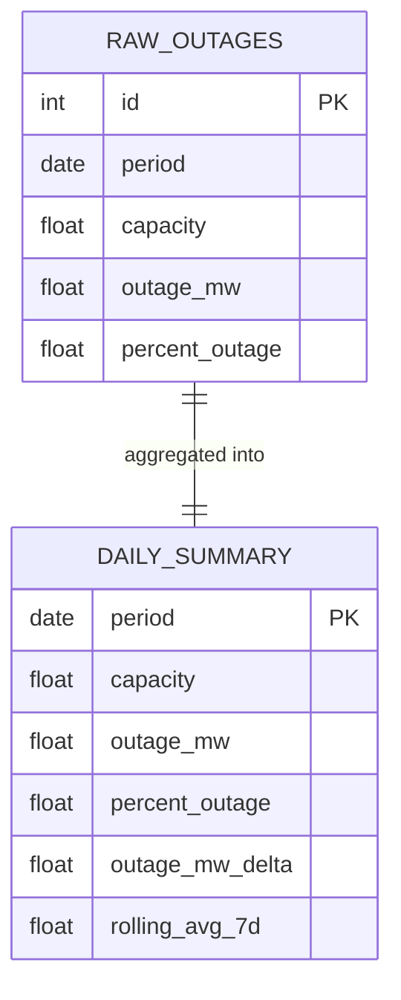

# ER Diagram – Nuclear Outages Pipeline

```mermaid
erDiagram
  RAW_OUTAGES {
    int id PK
    date period
    float capacity
    float outage_mw
    float percent_outage
  }
  DAILY_SUMMARY {
    date period PK
    float capacity
    float outage_mw
    float percent_outage
    float outage_mw_delta
    float rolling_avg_7d
  }
  RAW_OUTAGES ||--|| DAILY_SUMMARY : "aggregated into"
```
